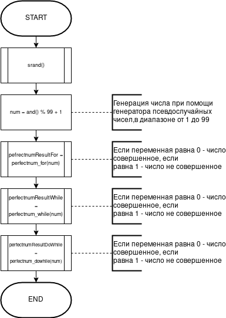
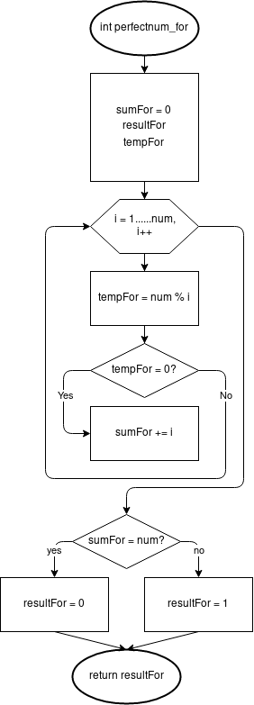
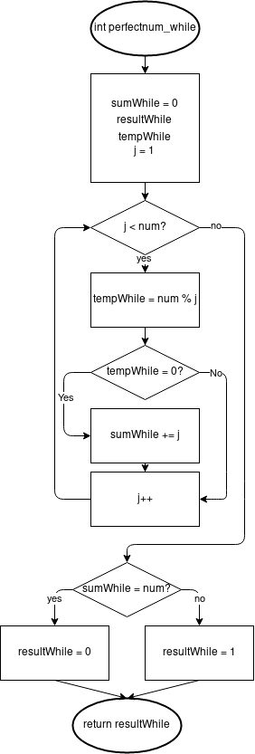
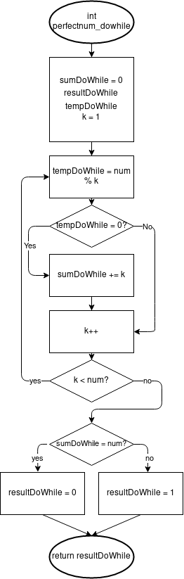
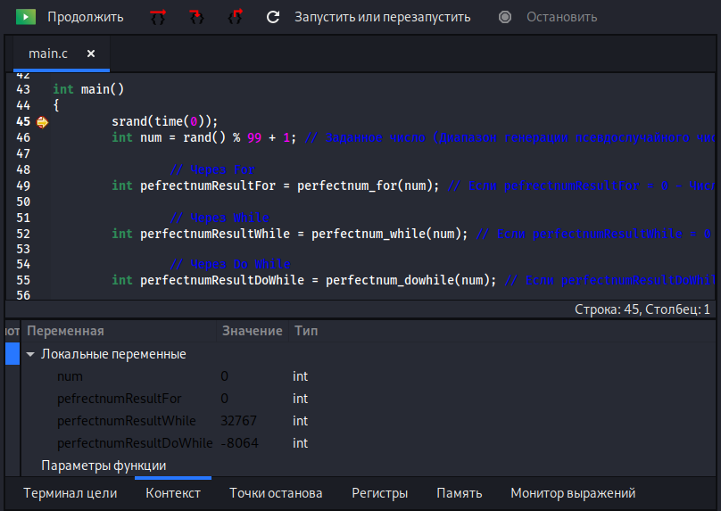
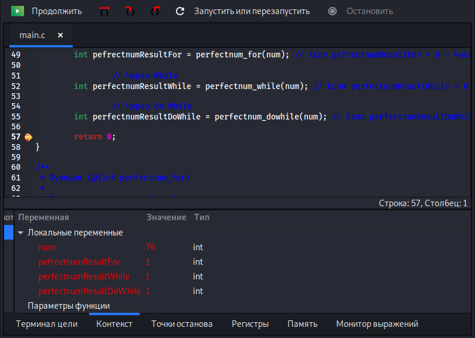

# Лабораторна робота №7. Функції
## 1 Вимоги
* **1.1 Розробник**
*	Кузнецов Микита Олександрович
*   студент групи КІТ – 320
*   19-dec-2020

* **1.2 Загальне завдання** 
* Переробити програми, що були розроблені під час виконання лабораторних робіт з тем "Масиви" та "Цикли" таким чином, щоб використовувалися функції для обчислення результату. 

* **1.3 Індивідуальне завдання** 
* Визначити, чи є задане число досконалим (якщо воно дорівнює сумі своїх дільників). Наприклад, 6 - досконале число, бо 6 = 1+2+3.

## 2 Опис програми
**2.1 Функціональне призначення** 
* Программа призначена для визначення досконалого числа, що декларовано в файлі *main.c*
* Результат обчислення зберігається у змінній *perfectnumResultFor, perfectnumResultWhile, perfectnumResultDoWhile*.
* Демонстрація отриманих результатів передбачає покрокове виконання програми в режимі налагодження.

**2.2 Опис логічної структури**
* За допомогою генератору псевдовипадкових чисел rand генеруємо значення для *num*, для отримання результату використовується функція *perfectnum_for, perfectnum_while, perfectnum_dowhile*, що знаходиться в *main.c*

*   **Основна функція** 
*   `int main`
*   *Призначення*: головна функція
*   *Схема алгоритму функції* подана на рис.1
*   *Опис роботи*: Виклик функції для генерації псевдовипадкових чисел, генерація числа для змінної, обчислення результату через цикл For/While/DoWhile за допомогою функції.



*   **Функція перевірки числа на досконалість циклом for**
*   `int perfectnum_for` (int num)
*   *Призначення*: визначення чи є число досконалим за допомогою циклу for.
*   *Схема алгоритму функції* подана на рис.2
*   *Опис роботи*: Знаходимо суму числа всіх своїх власних дільників, порівнюємо отриману суму з заданим числом.


     
*   **Функція перевірки числа на досконалість циклом while**
*   `int perfectnum_while` (int num)
*   *Призначення*: визначення чи є число досконалим за допомогою циклу while.
*   *Схема алгоритму функції* подана на рис.3
*   *Опис роботи*: Знаходимо суму числа всіх своїх власних дільників, порівнюємо отриману суму з заданим числом.
    	


*   **Функція перевірки числа на досконалість циклом do while**
*   `int perfectnum_dowhile` (int num)
*   *Призначення*: визначення чи є число досконалим за допомогою циклу do while.
*   *Схема алгоритму функції* подана на рис.4
*   *Опис роботи*: Знаходимо суму числа всіх своїх власних дільників, порівнюємо отриману суму з заданим числом.
    	


**Структура програми**
```
.
├── doc
│   ├── assets
│   │   ├── flowchart_main.png
│   │   ├── perfectnum_dowhile.png
│   │   ├── perfectnum_for.png
│   │   └── perfectnum_while.png
│   └── lab07(05_task4).md
├── Doxyfile
├── Makefile
├── README.md
└── src
    └── main.c
```
**2.3 Важливі елементи програми**

**Генерація псевдовипадкового числа**

   ```
    srand(time(0));	
	int num = rand() % 99 + 1;
   ```
**Обчислення через функцію perfectnum_for**

   ```
    int sumFor = 0;
	int resultFor;
	int tempFor;
	for (int i = 1; i < num; i++) {
		tempFor = num % i;
		if (tempFor == 0) {
			sumFor += i;
		}
	} 
	if (sumFor == num) {
		resultFor = 0; // 0 - Число совершенное 
	} else if (sumFor != num) {
		resultFor = 1; // 1 - Число не совершенное
	}
	return resultFor;
   ```
**Обчислення через функцію perfectnum_while**

   ```
    int sumWhile = 0;
	int resultWhile;
	int tempWhile;
	int j = 1;
	while (j < num) {
		tempWhile = num % j;
		if (tempWhile == 0) {
			sumWhile += j;
		}
		j++;
	}
	if (sumWhile == num) {
		resultWhile = 0; // 0 - Число совершенное
	} else if (sumWhile != num) {
		resultWhile = 1; // 1 - Число не совершенное
	}	
	return resultWhile;
   ```   
**Обчислення через функцію perfectnum_dowhile**

   ```
    int sumDoWhile = 0;
	int resultDoWhile;
	int tempDoWhile;
	int k = 1;
	do {
		tempDoWhile = num % k;
		if (tempDoWhile == 0) {
			sumDoWhile += k;
		}
		k++;
	} while (k < num);
	if (sumDoWhile == num) {
		resultDoWhile = 0; // 0 - Число совершенное
	}else if (sumDoWhile != num) {
		resultDoWhile = 1; // 1 - Число не совершенное
	}
	return resultDoWhile;	
   ```   

## 3 Варіанти використання
*   Для демонстрації результатів використовується покрокове виконання програми в інтегрованому середовищі *Nemiver*. Нижче наводиться послідовність дій запуску програми у режимі відлагодження.
*   *Крок 1 (див. рис.5)* - знаходячись в основній процедурі, досліджуємо стан змінних.

*   *Крок 2* - дослідження стану змінних наприкінці виконання основної функції. Результат зображено на рис.6.


## Висновки
*   При виконанні даної лабораторної роботи було набуто практичного досвіду роботи з функціями та генератором псевдовипадкового числа rand.
