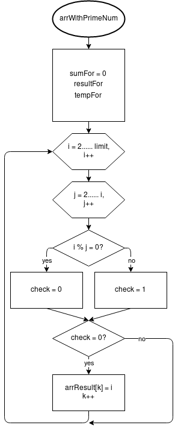

# Лабораторна робота №7. Функції
## 1 Вимоги
* **1.1 Розробник**
*	Кузнецов Микита Олександрович
*   студент групи КІТ – 320
*   19-dec-2020

* **1.2 Загальне завдання** 
* Переробити програми, що були розроблені під час виконання лабораторних робіт з тем "Масиви" та "Цикли" таким чином, щоб використовувалися функції для обчислення результату. 

* **1.3 Індивідуальне завдання** 
* Заповнити масив із заданої кількості елементів простими числами, що не повторюються. Розмір вихідного масиву задати наперед відомим значенням, що може будуть більшим аніж результуюча кількість отриманих елементів.

## 2 Опис програми
**2.1 Функціональне призначення** 
* Программа призначена для заповнення масива із заданої кількості елементів простими числами, що декларовано в файлі *main.c*
* Результат заповнення зберігається у масиві *arrResult*.
* Демонстрація отриманих результатів передбачає покрокове виконання програми в режимі налагодження.

**2.2 Опис логічної структури**
* За допомогою генератору псевдовипадкових чисел *rand* генеруємо значення для *arrSize*, який вказує на розмір результуючого масива, через змінну *limit* вказуємо діапазон пошуку простих чисел.
* Для отримання результату використовується функція *arrWithPrimeNum*, що знаходиться в *main.c*

*   **Основна функція** 
*   `int main`
*   *Призначення*: головна функція
*   *Схема алгоритму функції* подана на рис.1
*   *Опис роботи*: Виклик функції для генерації псевдовипадкових чисел, генерація числа для змінної, виклик функції.


*   **Функція заповнення масива простими числами**
*   `int perfectnum_for` (int num)
*   *Призначення*: заповнити масив простими числами
*   *Схема алгоритму функції* подана на рис.2
*   *Опис роботи*: Пошук простих чисел, запис простих чисел в масив.



**Структура програми**
```
.
├── doc
│   ├── assets
│   │   ├── arrWithPrimeNum.png
│   │   └── flowchart_main.png
│   └── lab07(06_task2).md
├── Doxyfile
├── Makefile
├── README.md
└── src
    └── main.c

```
**2.3 Важливі елементи програми**

**Генерація псевдовипадкового числа**

   ```
    srand(time(0));
	int arrSize = rand() % 45 + 15; // Размер массива в диапазоне от 15 до 45 символов
   ```
**Пошук та запис простих чисел в масив**

   ```
    int arrResult[arrSize]; // Объявление массива размером arrSize	
	int i,j,check;
	int k = 0; 
	for (int i = 2; i < limit; i++) {
		for (int j = 2; j < i; j++) {
			if (i % j == 0) {
				check = 1;  // Если check = 1 - число не простое
				break;
			} else {
				check = 0;	// Если check = 0 - число простое
			}
		}
		if (check == 0) { // Число простое - записываем его в массив, если число не простое - пропускаем
			arrResult[k] = i;
			k++;
		}
	}
	return resultFor;
   ```

## 3 Варіанти використання
*   Для демонстрації результатів використовується покрокове виконання програми в інтегрованому середовищі *Nemiver*. Нижче наводиться послідовність дій запуску програми у режимі відлагодження.
*   *Крок 1 (див. рис.3)* - знаходячись в основній процедурі, досліджуємо стан змінних.

*   *Крок 2* - дослідження стан масива наприкінці виконання основної функцї. Результат зображено на рис.4, результат пошуку та запису простих чисел можна побачити в масиві *arrResult*


## Висновки
*   При виконанні даної лабораторної роботи було набуто практичного досвіду роботи з функціями та генератором псевдовипадкового числа rand.
